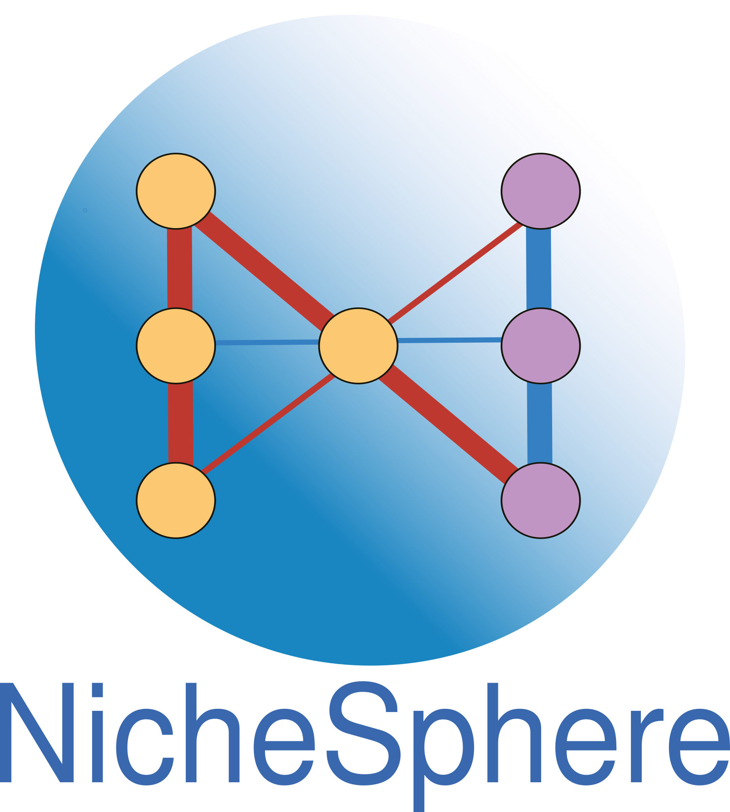

# NicheSphere

NicheSphere is an sc-verse compatible Python library which allows the user to find differential co-localization domains / niches based on cell type pair co-localization probabilities in different conditions. Cell type pair co-localization probabilities can be obtained in different ways, for example, through deconvolution of spatial transcriptomics / PIC-seq data (getting the probabilities of finding each cell type in each spot / multiplet) ; or counting nearest neighbors of each type for each cell in single cell spatial data like MERFISH or CODEX.

It also offers the possibility to look at biological process based differential communication between cell type pairs or differential co-localization domains based on Ligand-Receptor pairs expression data, which can be obtained from diverse cell cell communication tools, such as [CrossTalkeR](https://costalab.github.io/CrossTalkeR/).

You can find our documentation and an application example on the Myocardial Infarction atlas data from Kuppe et. al. 2022 here: https://nichesphere.readthedocs.io/en/latest/ , The data you'll need to run the tutorials is stored in [Zenodo](https://doi.org/10.5281/zenodo.15790389)

